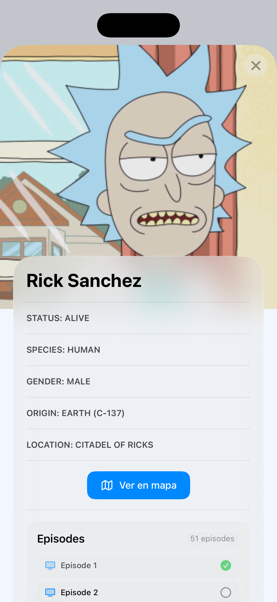
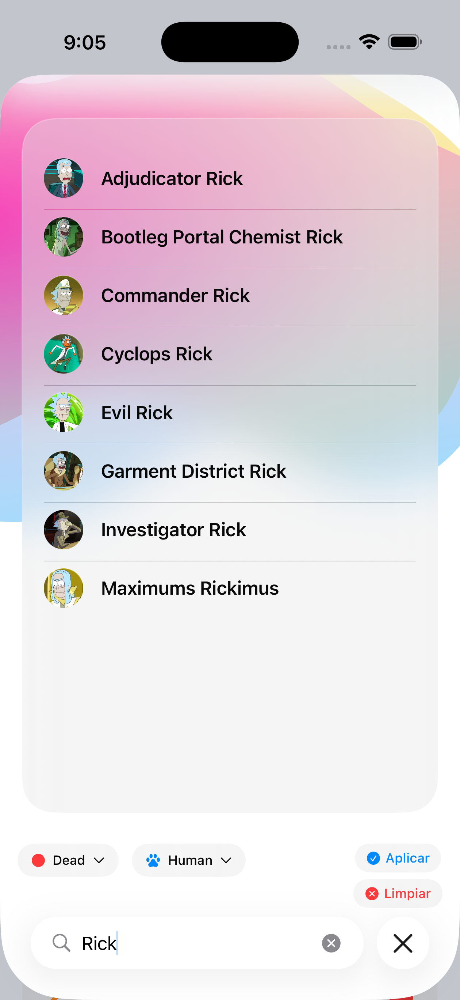
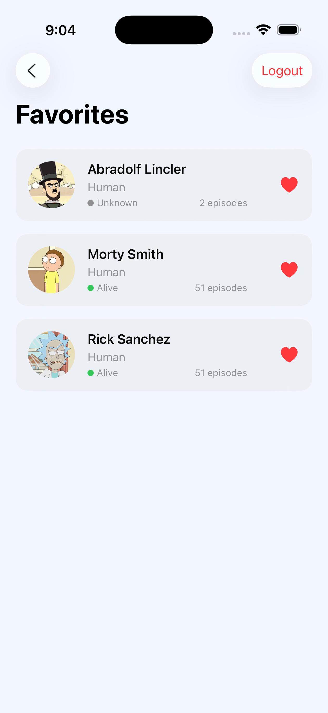
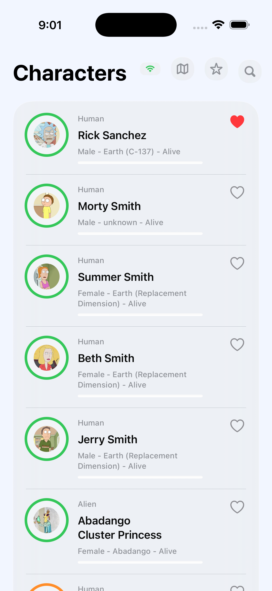
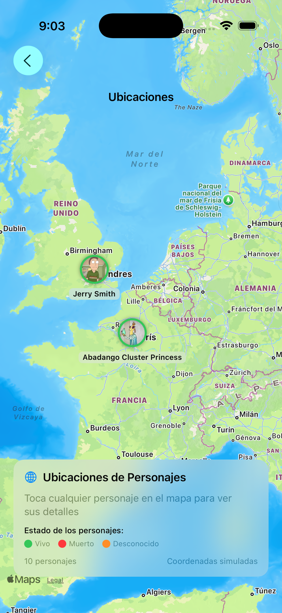
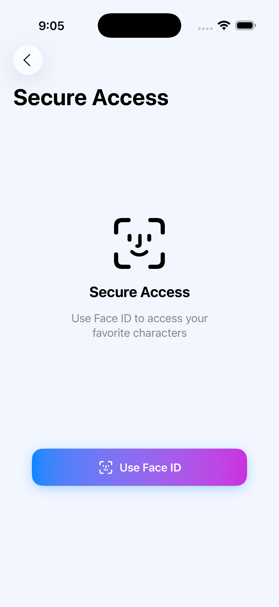

# Rick and Morty iOS App

Una aplicación iOS moderna desarrollada con SwiftUI que permite explorar el universo de Rick and Morty. La app consume la [Rick and Morty API](https://rickandmortyapi.com/) para mostrar personajes, episodios y ubicaciones con una interfaz elegante y funcionalidades avanzadas.

*Porque incluso en el multiverso, necesitas una app bien diseñada* 🧪

##  Características Principales

### 🏠 **Pantalla Principal**
- Lista de personajes con paginación automática
- Carga de datos desde API con caché local
- Indicador de estado de red en tiempo real
- Interfaz responsive con animaciones suaves

### 🔍 **Búsqueda Avanzada**
- Búsqueda de personajes por nombre
- Filtros por estado (Alive, Dead, Unknown)
- Filtros por especie
- Paginación automática en resultados

### ⭐ **Favoritos Seguros**
- Sistema de favoritos con autenticación biométrica
- Soporte para Touch ID, Face ID
- Almacenamiento local seguro con CoreData

### 🗺️ **Detalles de Personajes**
- Vista detallada con información completa
- Lista de episodios con progreso de visualización
- Mapa interactivo de ubicaciones
- Imágenes de alta calidad con carga asíncrona

### 🗺️ **Ubicaciones**
- Mira la última ubicación de cualquier personaje en MapKit
- Información detallada de cada ubicación

## Arquitectura

La aplicación sigue los principios de **Clean Architecture** con una separación clara de responsabilidades:

```
📁 RickAndMortyApp/
├── 🎨 Presentation Layer
│   ├── Views/ (SwiftUI Views)
│   ├── ViewModels/ (@Observable ViewModels)
│   ├── Components/ (Reusable UI Components)
│   └── Router/ (Navigation Management)
├── 🧠 Domain Layer
│   ├── UseCases/ (Business Logic)
│   ├── BusinessModels/ (Domain Models)
│   └── Services/ (Domain Services)
├── 💾 Data Layer
│   ├── Repositories/ (Data Access)
│   ├── CoreData/ (Local Storage)
│   └── Network/ (API Communication)
└── 🔧 Base Layer
    ├── DependencyInjection/ (Swinject Container)
    ├── NetworkMonitor/ (Connectivity)
    └── Cache/ (Memory Management)
```

## 🛠️ Tecnologías Utilizadas

### **Frontend**
- **SwiftUI** - Framework de UI moderno
- **Observation** - Sistema de observación reactivo
- **Combine** - Programación reactiva

### **Backend & Networking**
- **URLSession** - Comunicación con API
- **JSON Decoding** - Parsing de respuestas
- **Async/Await** - Programación asíncrona

### **Persistencia**
- **CoreData** - Base de datos local
- **NSCache** - Caché en memoria
- **LocalAuthentication** - Autenticación biométrica

### **Arquitectura & Patrones**
- **Swinject** - Inyección de dependencias
- **MVVM** - Patrón de arquitectura
- **Repository Pattern** - Acceso a datos
- **Use Case Pattern** - Lógica de negocio

### **Testing**
- **XCTest** - Framework de testing
- **Mock Objects** - Simulación de dependencias
- **Unit Tests** - Pruebas unitarias

## 📋 Requisitos del Sistema

- **iOS 15.0+**
- **Xcode 15.0+**
- **Swift 5.9+**
- **macOS 14.0+** (para desarrollo)

## 🚀 Instalación y Configuración

### 1. **Clonar el Repositorio**
```bash
git clone https://github.com/zepedag/RickAndMortyApp.git
cd RickAndMortyApp
```

### 2. **Abrir en Xcode**
```bash
open RickAndMortyApp.xcodeproj
```

### 3. **Configurar Dependencias**
Las dependencias se instalan automáticamente via Swift Package Manager:
- **Swinject 2.10.0** - Inyección de dependencias

### 4. **Compilar y Ejecutar**
1. Selecciona el simulador iOS deseado
2. Presiona `Cmd + R` o haz clic en el botón ▶️
3. La app se compilará y ejecutará automáticamente


## 🧪 Testing

### **Ejecutar Tests Unitarios**
```bash
# En Xcode: Cmd + U
# O desde terminal:
xcodebuild test -scheme RickAndMortyApp -destination 'platform=iOS Simulator,name=iPhone 15'
```

### **Cobertura de Tests**
- ✅ CharacterRepository
- ✅ CharacterUseCase  
- ✅ HomeViewModel
- ✅ SearchViewModel
- ✅ MockApiService


## 📱 Capturas de Pantalla

| Pantalla Principal | Búsqueda | Favoritos |
|-------------------|----------|-----------|
|  |  |  |

| Detalles | Ubicaciones | Autenticación |
|----------|-------------|---------------|
|  |  |  |


### **Estándares de Código**
- Sigue las convenciones de Swift
- Implementación de Swiftlint
- Documenta funciones públicas
- Escribe tests para nueva funcionalidad
- Sigue los principios de Clean Architecture


##  Desarrollador

**Humberto Alejandro Zepeda González**
- GitHub: [@zepedag](https://github.com/zepedag)
- LinkedIn: [hzepedag](https://linkedin.com/in/hzepedag)
- Mail: [Gmail](mailto:hazepedag@gmail.com)
- (+52) 2225670000

